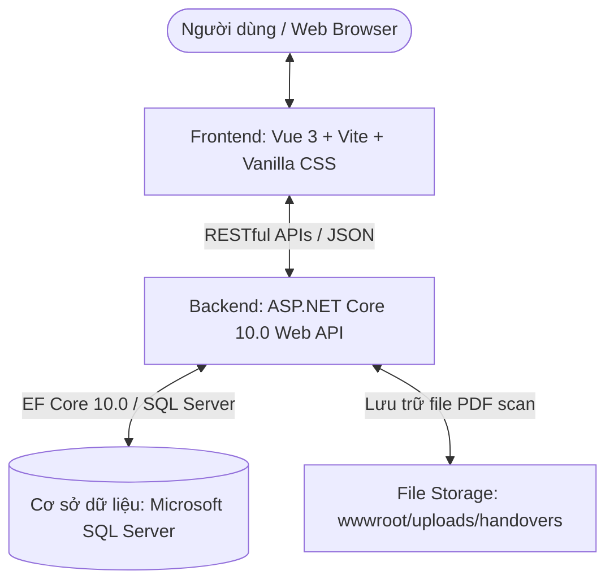
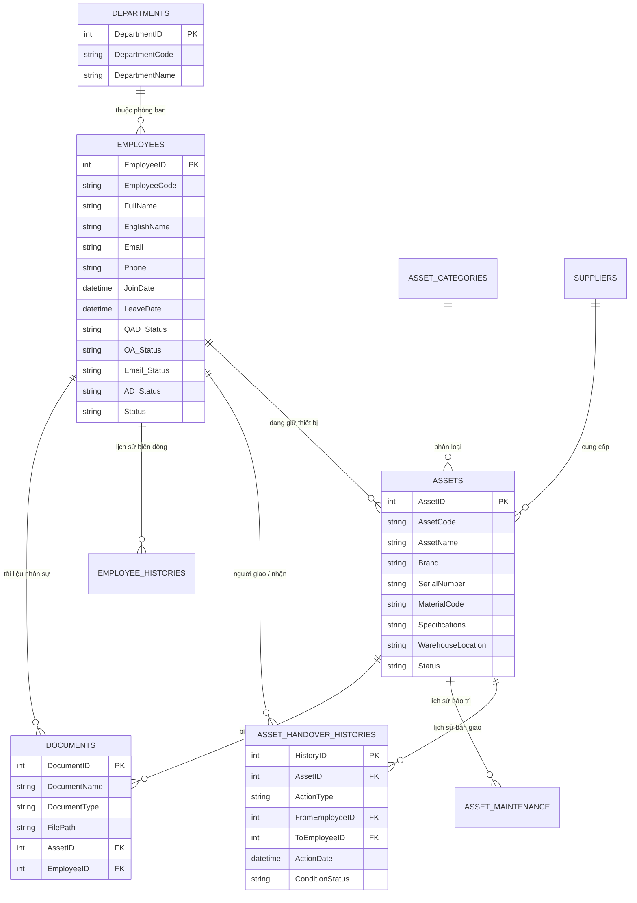

# 🏢 QLKHO - HỆ THỐNG QUẢN LÝ KHO TÀI SẢN IT & BÀN GIAO THIẾT BỊ DOANH NGHIỆP

> **Hệ thống Quản lý Thiết bị Doanh nghiệp (Enterprise IT Asset & Employee Equipment Management System)**  
> Giải pháp toàn diện giúp bộ phận IT & Nhân sự (HR) theo dõi vòng đời thiết bị máy tính, quản lý 4 tài khoản hệ thống (QAD, OA, Email, AD), cấp phát trọn gói, thu hồi, điều chuyển, quản lý hồ sơ biên bản bàn giao PDF và phân tích sự cố bảo trì theo thời gian thực.

---

## 📑 MỤC LỤC

1. [Tổng Quan Dự Án](#-tổng-quan-dự-án)
2. [Kiến Trúc & Công Nghệ Sử Dụng](#-kiến-trúc--công-nghệ-sử-dụng)
3. [Cấu Trúc Thư Mục Dự Án](#-cấu-trúc-thư-mục-dự-án)
4. [Các Phân Hệ & Tính Năng Trọng Tâm](#-các-phân-hệ--tính-năng-trọng-tâm)
   - [1. Quản Lý Kho Tài Sản IT (`Assets`)](#1-quản-lý-kho-tài-sản-it-assets)
   - [2. Cấp Phát Trọn Gói ACID (`Bundle Assign`)](#2-cấp-phát-trọn-gói-acid-bundle-assign)
   - [3. Quản Lý Nhân Sự & 4 Tài Khoản Hệ Thống (`Employees`)](#3-quản-lý-nhân-sự--4-tài-khoản-hệ-thống-employees)
   - [4. Cảnh Báo Nghỉ Việc & Chưa Có Biên Bản](#4-cảnh-báo-nghỉ-việc--chưa-có-biên-bản)
   - [5. Quản Lý Lô Phụ Kiện Tự Động Sinh Mã (Chuột / Bàn Phím)](#5-quản-lý-lô-phụ-kiện-tự-động-sinh-mã-chuột--bàn-phím)
   - [6. Lưu Trữ Hồ Sơ PDF Scan Theo Thiết Bị (`Documents`)](#6-lưu-trữ-hồ-sơ-pdf-scan-theo-thiết-bị-documents)
   - [7. In Biên Bản Bàn Giao A4 Chuẩn Doanh Nghiệp](#7-in-biên-bản-bàn-giao-a4-chuẩn-doanh-nghiệp)
   - [8. Dashboard Phân Tích & Biểu Đồ Sự Cố Theo Tháng](#8-dashboard-phân-tích--biểu-đồ-sự-cố-theo-tháng)
   - [9. Import & Export Excel / CSV UTF-8 BOM](#9-import--export-excel--csv-utf-8-bom)
5. [Mô Hình Cơ Sở Dữ Liệu (`Database Schema`)](#-mô-hình-cơ-sở-dữ-liệu-database-schema)
6. [Phân Quyền Người Dùng (`RBAC`)](#-phân-quyền-người-dùng-rbac)
7. [Hướng Dẫn Cài Đặt & Vận Hành](#-hướng-dẫn-cài-đặt--vận-hành)
8. [Tài Khoản Mặc Định](#-tài-khoản-mặc-định)

---

## 🌟 TỔNG QUAN DỰ ÁN

Hệ thống **QLKho** được thiết kế nhằm số hóa và tối ưu hóa 100% quy trình quản trị tài sản Công nghệ thông tin trong doanh nghiệp, giải quyết các bài toán:
- **Quản lý vòng đời tài sản**: Từ lúc nhập kho, dán mã Host Name/Serial, cấp phát cho nhân viên, điều chuyển giữa các phòng ban, gửi đi sửa chữa/bảo hành đến khi thu hồi về kho hoặc thanh lý.
- **Đồng bộ IT & HR**: Kiểm soát trạng thái 4 tài khoản nghiệp vụ của nhân sự (**QAD, OA, Email Công Ty, Active Directory**) song song với số lượng máy móc họ đang nắm giữ.
- **Chống thất thoát tài sản**: Cảnh báo sớm nhân viên sắp nghỉ việc nhưng chưa thu hồi máy tính hoặc chưa khóa tài khoản; cảnh báo thiết bị đã bàn giao nhưng chưa nạp file scan PDF biên bản có chữ ký.
- **Tiêu chuẩn hóa in ấn**: Xuất biên bản bàn giao thiết bị ra file PDF/In trực tiếp chuẩn khổ giấy A4 theo đúng form mẫu thực tế của doanh nghiệp.

---

## 🛠️ KIẾN TRÚC & CÔNG NGHỆ SỬ DỤNG



### 1. Backend API (`QLKho.Api`)
- **Framework**: `.NET 10.0 (C#)`
- **ORM**: `Entity Framework Core 10.0 (Code First / SQL Server Provider)`
- **Kiến trúc**: **Layered Architecture / Service-Repository Pattern**
  - `Controllers`: Tiếp nhận Request HTTP, Validate ModelState, gọi Services.
  - `Services (Interfaces & Implementations)`: Xử lý toàn bộ Business Logic (Asset, Employee, Dashboard, Common, Import, Export).
  - `Models / DTOs`: Định dạng dữ liệu truyền nhận (Data Transfer Objects).
  - `Models / Entities`: Mô hình thực thể cơ sở dữ liệu.
  - `Data / AppDbContext`: Cấu hình quan hệ bảng, Cascade Delete, Check Constraints.
- **Ghi log & Xử lý lỗi**: Tích hợp Global Exception Handling, EF Execution Strategy.

### 2. Frontend Web Client (`quanlikho`)
- **Framework**: `Vue 3 (Composition API với <script setup>)`
- **Build Tool**: `Vite 8.2`
- **Routing**: `Vue Router 4`
- **HTTP Client**: `Axios` (Tích hợp Request/Response Interceptor tự động gán Token, xử lý FormData và bắt lỗi)
- **Thiết kế UI/UX**: `Vanilla CSS Modern Design System` (CSS Variables, Glassmorphism, Dark/Light palettes, responsive đa màn hình, hiệu ứng micro-animations mượt mà)
- **Thư viện phụ trợ**: `jspdf` & `html2canvas` (In/xuất PDF chuẩn A4), `xlsx` (Đọc/ghi file Excel/CSV).

### 3. Cơ Sở Dữ Liệu
- **Hệ quản trị**: `PostgreSQL 16+` (Sử dụng provider `Npgsql.EntityFrameworkCore.PostgreSQL`)
- **Tên DB**: `QLKhoAssetDB`
- **Hỗ trợ**: Unicode Tiếng Việt (`VARCHAR`, `TEXT`), Khóa ngoại ràng buộc toàn vẹn dữ liệu, tự động khởi tạo Schema (`EnsureCreated`).

---

## 📂 CẤU TRÚC THƯ MỤC DỰ ÁN

```text
d:/Project/QLkho/
├── QLKho.Api/                        # Source Code Backend ASP.NET Core
│   ├── Controllers/                  # API Controllers (Assets, Employees, Dashboard, Documents...)
│   ├── Data/                         # AppDbContext & Cấu hình Entity Framework
│   ├── Models/
│   │   ├── Entities/                 # Database Entities (Asset, Employee, Document, History...)
│   │   └── DTOs/                     # DTOs (AssetDtos, EmployeeDtos, DashboardDtos...)
│   ├── Services/
│   │   ├── Interfaces/               # Giao diện dịch vụ (IAssetService, IEmployeeService...)
│   │   └── Implementations/          # Triển khai dịch vụ (AssetService, EmployeeService...)
│   ├── Utils/                        # Các hàm tiện ích bổ trợ
│   ├── wwwroot/                      # Thư mục lưu trữ tĩnh (File PDF bàn giao đã scan)
│   ├── appsettings.json              # Chuỗi kết nối Database & cấu hình hệ thống
│   └── Program.cs                    # Điểm khởi động ứng dụng & cấu hình DI Containers
│
├── quanlikho/                        # Source Code Frontend Vue 3
│   ├── public/                       # Assets tĩnh & Logo
│   ├── src/
│   │   ├── api/                      # Client Axios & cấu hình Auth
│   │   ├── components/               # Components dùng chung (Modal, Toast, StatusBadge, Widgets...)
│   │   ├── views/                    # Các trang màn hình chính:
│   │   │   ├── DashboardView.vue     # Trang tổng quan & biểu đồ
│   │   │   ├── AssetsView.vue        # Quản lý kho tài sản & cấp phát
│   │   │   │   └── AssetsView/       # Sub-modals (Form, Detail, Assign, Return, History...)
│   │   │   ├── EmployeesView.vue     # Quản lý nhân sự & 4 tài khoản
│   │   │   │   └── EmployeesView/    # Sub-tabs (Active, Resigned, Onboarding, Alerts, History...)
│   │   │   ├── DocumentsView.vue     # Lưu trữ & tra cứu hồ sơ PDF scan
│   │   │   ├── CategoriesSuppliersView.vue # Danh mục loại tài sản & Nhà cung cấp
│   │   │   └── UsersView.vue         # Quản trị tài khoản & phân quyền
│   │   ├── utils/                    # Xử lý Excel, CSV, PDF, ngày tháng
│   │   ├── App.vue                   # Root Component
│   │   └── main.js                   # Điểm khởi động Vue App
│   ├── index.html
│   ├── package.json
│   └── vite.config.js
│
├── database/                         # Kịch bản cơ sở dữ liệu
│   ├── mssql_schema_and_seed.sql     # Script tạo bảng & nạp dữ liệu mẫu ban đầu
│   └── README_DB.md                  # Hướng dẫn cấu hình kết nối DB
│
└── README.md                         # Tài liệu hướng dẫn toàn diện dự án
```

---

## 🎯 CÁC PHÂN HỆ & TÍNH NĂNG TRỌNG TÂM

### 1. Quản Lý Kho Tài Sản IT (`Assets`)
- **Hiển thị thông minh**: Tự động đưa các nhóm phụ kiện có số lượng (Chuột, Bàn phím lô) lên đầu bảng; các dòng máy tính cá nhân (Laptop, Desktop PC, Màn hình) xếp theo thứ tự ưu tiên: `Sẵn sàng` $\rightarrow$ `Đang cấp phát` $\rightarrow$ `Đang bảo trì` $\rightarrow$ `Bị hỏng`.
- **Cố định khung bảng (`table-layout: fixed`)**: Khi click mở rộng chi tiết các con chuột trong lô, bảng giữ nguyên kích thước từng pixel, không bị nhảy hay xô lệch cột.
- **Bộ lọc đa năng**: Tìm kiếm tức thì theo Host Name, Model, Serial/Service Tag, Mã VT, Người đang giữ, Hãng sản xuất, Phòng ban, Trạng thái.
- **Chi tiết thiết bị & Timeline**: Xem toàn bộ thông số kỹ thuật (CPU, RAM, Ổ cứng, Màn hình, Sạc đi kèm) và dòng thời gian lịch sử cấp phát từ ngày mua đến hiện tại.

### 2. Cấp Phát Trọn Gói ACID (`Bundle Assign`)
- Nghiệp vụ cấp máy chuẩn cho nhân viên mới chỉ bằng 1 thao tác duy nhất:
  - Chọn **Laptop chính** (hoặc PC).
  - Tự động gợi ý & chọn kèm **Chuột**, **Bàn phím**, **Màn hình phụ** có sẵn trong kho.
  - Backend thực thi trong **Transaction ACID** duy nhất: Cập nhật trạng thái tất cả thiết bị sang `In-Use`, gán `CurrentHolderID`, tự động sinh các bản ghi Lịch sử bàn giao (`AssetHandoverHistories`) và Lịch sử nhân sự (`EmployeeHistories`).

### 3. Quản Lý Nhân Sự & 4 Tài Khoản Hệ Thống (`Employees`)
- **Theo dõi 4 Tài khoản cốt lõi**:
  - 🖥️ **QAD**: Tài khoản phần mềm ERP/Kế toán/Sản xuất.
  - 📋 **OA**: Tài khoản phần mềm quản trị văn phòng/trình ký.
  - ✉️ **Email Cty**: Hộp thư điện tử doanh nghiệp.
  - 🔑 **Active Directory (AD)**: Tài khoản đăng nhập máy tính miền domain & mạng nội bộ.
- **Trạng thái tài khoản**: `Available` (Đang hoạt động - Xanh), `Disable` (Đang khóa - Xám), `Deleted` (Đã xóa - Đỏ).
- **Phân loại Tab nhân sự**:
  - 💼 **Đang làm việc (`Active`)**: Danh sách nhân viên chính thức đang công tác.
  - 🚀 **Chờ đi làm (`Onboarding`)**: Nhân sự mới sắp gia nhập, đếm ngược số ngày còn lại, chuẩn bị sẵn máy tính và email.
  - 📁 **Đã nghỉ việc (`Resigned`)**: Nhân viên đã thôi việc, kiểm tra việc hoàn tất bàn giao máy và vô hiệu hóa tài khoản.

### 4. Cảnh Báo Nghỉ Việc & Chưa Có Biên Bản
- ⚠️ **Cảnh Báo Nghỉ Việc**: Tự động lọc ra những nhân sự đã có ngày nghỉ việc (`LeaveDate`) hoặc trạng thái `Resigned` nhưng **vẫn còn đang giữ thiết bị** hoặc **chưa bị vô hiệu hóa 4 tài khoản hệ thống**.
- 📑 **Cảnh Báo Chưa Có Biên Bản**: Liệt kê các thiết bị đã bàn giao cho nhân viên sử dụng nhưng chưa được tải lên file scan PDF biên bản bàn giao có chữ ký để IT bổ sung kịp thời.

### 5. Quản Lý Lô Phụ Kiện Tự Động Sinh Mã (Chuột / Bàn Phím)
- Khi nhập số lượng lớn chuột / bàn phím theo lô (Vd: nhập 20 con chuột Logitech M10):
  - Hệ thống tự động phân tích mã cao nhất hiện có trong DB (Vd: `MOU-LOGI-05`).
  - Tự động sinh dải mã liên tục tiếp theo (`MOU-LOGI-06` $\rightarrow$ `MOU-LOGI-25`).
  - Trên giao diện được gom thành 1 dòng duy nhất: `Chuột Logitech (📦 20 con)` kèm thống kê nhanh số con trong kho, số con đang dùng và số con bị hỏng.

### 6. Lưu Trữ Hồ Sơ PDF Scan Theo Thiết Bị (`Documents`)
- Mỗi thiết bị khi bàn giao cho nhân viên sẽ có biên bản riêng biệt.
- Khi tải lên file scan PDF cho một thiết bị cụ thể:
  - Chỉ thiết bị đó nhận biên bản (`handoverDocument`).
  - Tự động lưu và đồng bộ vào phân hệ **"Lưu Trữ Hồ Sơ PDF"** (`DocumentsView`) với đầy đủ metadata: Tên biên bản, Thiết bị, Nhân viên, Phòng ban, Ngày nạp, Link xem trước / tải về.

### 7. In Biên Bản Bàn Giao A4 Chuẩn Doanh Nghiệp
- Tích hợp modal in biên bản trực tiếp trên trình duyệt:
  - Form in biên bản chuẩn khổ giấy A4, có logo doanh nghiệp, tiêu đề Quốc hiệu, thông tin chi tiết máy móc (Laptop, Chuột, Sạc, Tình trạng), cam kết trách nhiệm của người nhận và các ô ký tên (Người bàn giao, Người nhận, Trưởng bộ phận, IT).
  - Hỗ trợ in đơn lẻ hoặc in gộp nhiều thiết bị cùng lúc.

### 8. Dashboard Phân Tích & Biểu Đồ Sự Cố Theo Tháng
- **Thống kê KPI thời gian thực**: Tổng tài sản, Số lượng sẵn sàng, Đang cấp phát, Bị hỏng, Đang sửa chữa, Nhân sự đang làm việc.
- **Biểu đồ Cột Hãng Hỏng & Bảo Trì**: Truy vấn trực tiếp từ bảng Lịch sử bàn giao (`AssetHandoverHistories`) để thống kê chính xác số lượt sự cố theo từng Hãng (Dell, HP, Lenovo, LG, Logitech...) và hỗ trợ lọc động theo từng Tháng (`yyyy-MM`) hoặc toàn thời gian.
- **Biểu đồ phân bổ tài sản theo phòng ban**: Tỷ lệ phần trăm thiết bị đang được sử dụng tại các khối phòng ban.

### 9. Import & Export Excel / CSV UTF-8 BOM
- **Import Excel thông minh**: Nhập danh sách nhân sự, thiết bị từ file Excel (.xlsx), tự động nhận diện cột linh hoạt không phụ thuộc thứ tự cột, tự động khớp phòng ban/loại thiết bị và tạo mới nếu chưa có.
- **Export CSV chuẩn UTF-8 BOM**:
  - Xuất dữ liệu nhân sự riêng biệt: *DS Đang làm việc*, *DS Đã nghỉ việc* (có cột ngày nghỉ, tình trạng bàn giao máy), *DS Chờ đi làm*.
  - Xuất danh sách tài sản, lịch sử bàn giao không bị lỗi font tiếng Việt khi mở trực tiếp trên Microsoft Excel.

---

## 🗄️ MÔ HÌNH CƠ SỞ DỮ LIỆU (`DATABASE SCHEMA`)



---

## 👥 PHÂN QUYỀN NGƯỜI DÙNG (`RBAC`)

| Tính Năng / Nghiệp Vụ | Quản Trị Viên (`Admin`) / IT | Nhân Sự (`HR`) |
| :--- | :---: | :---: |
| **Xem Dashboard & Thống kê tài sản** | ✅ Toàn quyền | ✅ Xem |
| **Thêm, sửa, xóa, quản lý thiết bị trong kho** | ✅ Toàn quyền | 🔒 Không có quyền |
| **Cấp phát, Thu hồi, Điều chuyển máy tính** | ✅ Toàn quyền | 🔒 Không có quyền |
| **Báo hỏng, Đi sửa, Bảo trì thiết bị** | ✅ Toàn quyền | 🔒 Không có quyền |
| **Quản lý danh sách nhân sự (Thêm/Sửa thông tin cơ bản)** | ✅ Toàn quyền | ✅ Toàn quyền |
| **Bật/Tắt 4 tài khoản hệ thống (QAD, OA, Email, AD)** | ✅ Quyền IT/Admin | 🔒 Chỉ xem (Chế độ HR Read-only) |
| **Theo dõi nhân sự mới & Onboarding** | ✅ Xem | ✅ Quản lý chính |
| **Theo dõi Cảnh báo nghỉ việc & Thiếu biên bản** | ✅ Toàn quyền | ✅ Xem cảnh báo |
| **Import / Export Excel dữ liệu** | ✅ Toàn quyền | ✅ Toàn quyền |

---

## 🚀 HƯỚNG DẪN CÀI ĐẶT & VẬN HÀNH

### 1. Yêu Cầu Môi Trường
- **Hệ điều hành**: Windows 10/11 hoặc Windows Server.
- **.NET SDK**: Phiên bản **.NET 10.0** trở lên.
- **Node.js**: Phiên bản **Node.js 18.x** trở lên & npm.
- **Database**: **Microsoft SQL Server** (2019, 2022 hoặc SQL Express / LocalDB).

---

### 2. Cài Đặt Cơ Sở Dữ Liệu
1. Mở **SQL Server Management Studio (SSMS)** hoặc **Azure Data Studio**.
2. Kết nối tới SQL Server của bạn.
3. Mở file script: `d:\Project\QLkho\database\mssql_schema_and_seed.sql` và nhấn **Execute (F5)** để tự động tạo cơ sở dữ liệu `QLKhoAssetDB`, toàn bộ bảng và dữ liệu mẫu.

---

### 3. Khởi Chạy Backend API
1. Mở terminal, điều hướng đến thư mục backend:
   ```bash
   cd d:/Project/QLkho/QLKho.Api
   ```
2. Kiểm tra cấu hình chuỗi kết nối Database trong file `appsettings.json`:
   ```json
   "ConnectionStrings": {
     "DefaultConnection": "Server=localhost;Database=QLKhoAssetDB;Trusted_Connection=True;TrustServerCertificate=True;MultipleActiveResultSets=true"
   }
   ```
3. Khôi phục packages & chạy ứng dụng:
   ```bash
   dotnet restore
   dotnet run
   ```
4. Backend API sẽ khởi chạy tại địa chỉ: `http://localhost:5000` (Swagger UI: `http://localhost:5000/swagger`).

---

### 4. Khởi Chạy Frontend Client
1. Mở một cửa sổ terminal mới, điều hướng đến thư mục frontend:
   ```bash
   cd d:/Project/QLkho/QLkho.Web
   ```
2. Cài đặt các thư viện phụ thuộc:
   ```bash
   npm install
   ```
3. Khởi chạy Development Server:
   ```bash
   npm run dev
   ```
4. Truy cập hệ thống trên trình duyệt tại: `http://localhost:5173`.

---

## 🐳 TRIỂN KHAI VỚI DOCKER COMPOSE (Khuyến Nghị Cho Production)

Dự án đã được đóng gói toàn diện với Docker Compose, bao gồm **PostgreSQL 16 Alpine**, **.NET 10 Web API** và **Vue 3 Web App (Nginx Reverse Proxy)**.

### 1. Khởi chạy toàn bộ hệ thống bằng 1 lệnh:
```bash
# Đứng tại thư mục gốc dự án d:/Project/QLkho/
docker compose up -d --build
```

### 2. Kiểm tra trạng thái các container:
```bash
docker compose ps
```

### 3. Địa chỉ truy cập sau khi deploy:
- **Ứng Dụng Web (Frontend & Nginx)**: `http://localhost:8080`
- **Backend Web API (Trực tiếp)**: `http://localhost:5000` (Swagger: `http://localhost:5000/swagger`)
- **PostgreSQL Database**: `localhost:5432` (User: `postgres` | Password: `QLKho@Asset2026Secure!` | Database: `QLKhoAssetDB`)

### 4. Dừng hệ thống:
```bash
docker compose down
```

---

## 🔐 TÀI KHOẢN MẶC ĐỊNH

Hệ thống được khởi tạo sẵn các tài khoản thử nghiệm sau:

| Tên Đăng Nhập (`Username`) | Mật Khẩu (`Password`) | Quyền Hạn (`Role`) | Ghi Chú |
| :--- | :--- | :--- | :--- |
| **`admin`** | `admin123` | **Administrator** | Toàn quyền quản trị hệ thống, kho bãi & tài khoản |
| **`it_support`** | `admin123` | **IT Support** | Quản lý thiết bị, cấp phát, bảo trì, in ấn biên bản |
| **`hr`** | `admin123` | **HR** | Quản lý nhân sự, theo dõi onboarding, xem cảnh báo |

---

## 📄 BẢN QUYỀN & TÁC GIẢ

- **Dự án**: Phần mềm Quản Lý Kho & Tài Sản Doanh Nghiệp (QLKho)
- **Đơn vị phát triển**: Đội ngũ Kỹ thuật & CNTT Nội bộ
- **Phiên bản**: `v2.0.0 Enterprise Edition` (Hỗ trợ Kiến trúc Service Backend & Quản lý thiết bị độc lập).
