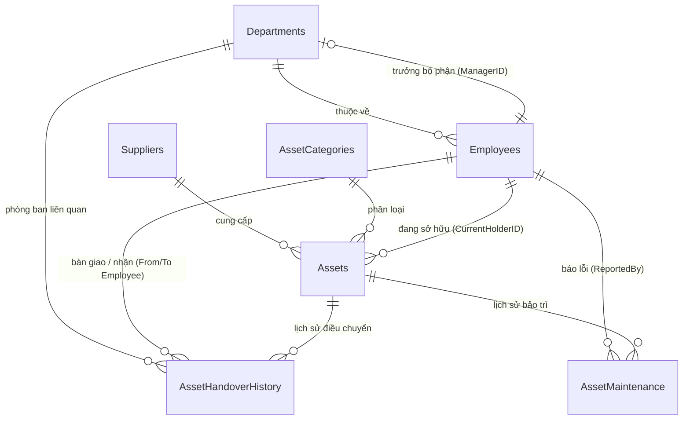

# TÀI LIỆU THIẾT KẾ CƠ SỞ DỮ LIỆU (DATABASE SCHEMA SPECIFICATION)
**Hệ quản trị CSDL**: Microsoft SQL Server  
**Tên CSDL**: `QLKhoAssetDB`  
**File thực thi**: [`database/mssql_schema_and_seed.sql`](file:///d:/Project/QLkho/database/mssql_schema_and_seed.sql)

---

## 1. Sơ đồ Quan hệ Bảng (Database Relationship / ERD)

---

## 2. Danh sách các Bảng & Chức năng

| STT | Tên Bảng | Mô tả chức năng |
| :--- | :--- | :--- |
| 1 | **`Departments`** | Quản lý danh mục Bộ phận / Phòng ban và Manager phụ trách. |
| 2 | **`Employees`** | Thông tin nhân sự, ngày vào/nghỉ, và **trạng thái 4 tài khoản hệ thống: QAD, OA, Email, AD** (`Available`, `Disable`, `Deleted`). |
| 3 | **`Suppliers`** | Danh mục Nhà cung cấp / Đơn vị bảo hành. |
| 4 | **`AssetCategories`** | Phân loại thiết bị: *Laptop, PC, Màn hình, Thiết bị mạng, Máy in...* |
| 5 | **`Assets`** | Quản lý chi tiết thiết bị, S/N, bảo hành, trạng thái (`Available`, `In-Use`, `Broken`, `Maintenance`, `Disposed`), người giữ và vị trí. |
| 6 | **`AssetHandoverHistory`** | Ghi vết toàn bộ vòng đời: Cấp phát (`Assign`), Thu hồi (`Return`), Điều chuyển (`Transfer`), Sửa chữa (`SendMaintenance`), Thanh lý (`Dispose`). |
| 7 | **`AssetMaintenance`** | Quản lý bảo hành, lỗi hỏng hóc, chi phí, đơn vị sửa và tiến độ hoàn thành. |

---

## 3. Các Views và Stored Procedures hỗ trợ Báo cáo & Nghiệp vụ

### 3.1 Views phục vụ Dashboard & Cảnh báo:
- **`vw_AssetsDetail`**: Tự động tính toán **Vị trí động (DynamicLocation)**:
  - Nếu thiết bị có người sở hữu $\rightarrow$ Vị trí là **Tên Bộ phận** của người đó.
  - Nếu thiết bị trong kho / chưa cấp $\rightarrow$ Vị trí là **Vị trí trong kho IT** (Kệ A1, Tủ kính B2...).
- **`vw_AssetKPIOverview`**: Thống kê tức thì: Tổng thiết bị, Số lượng Đang dùng (`In-Use`), Tồn kho sẵn sàng (`Available`), Hỏng hóc (`Broken`), Đang bảo hành (`Maintenance`).
- **`vw_EmployeeLeaveAlerts`**: Cảnh báo những nhân sự **Đã có ngày nghỉ việc** nhưng vẫn còn cầm tài sản hoặc chưa khóa tài khoản (`QAD`, `OA`, `Email`, `AD`).

### 3.2 Stored Procedures nghiệp vụ (Transactional):
- **`sp_AssignAsset`**: Cấp phát thiết bị cho nhân viên $\rightarrow$ Tự động chuyển trạng thái sang `In-Use`, gán vị trí theo phòng ban, ghi lịch sử vào `AssetHandoverHistory`.
- **`sp_ReturnAsset`**: Thu hồi máy về kho $\rightarrow$ Chuyển trạng thái về `Available` (hoặc `Broken` nếu hỏng), reset chủ sở hữu, trả về vị trí kho IT và ghi log lịch sử.

---

## 4. Cách chạy Script trên Microsoft SQL Server

1. Mở **SQL Server Management Studio (SSMS)** hoặc **Azure Data Studio**.
2. Kết nối tới SQL Server Instance của bạn.
3. Mở file [database/mssql_schema_and_seed.sql](file:///d:/Project/QLkho/database/mssql_schema_and_seed.sql).
4. Nhấn **Execute (F5)** để tự động tạo Database `QLKhoAssetDB`, các bảng, ràng buộc, View, SP và toàn bộ Seed Data mẫu.
